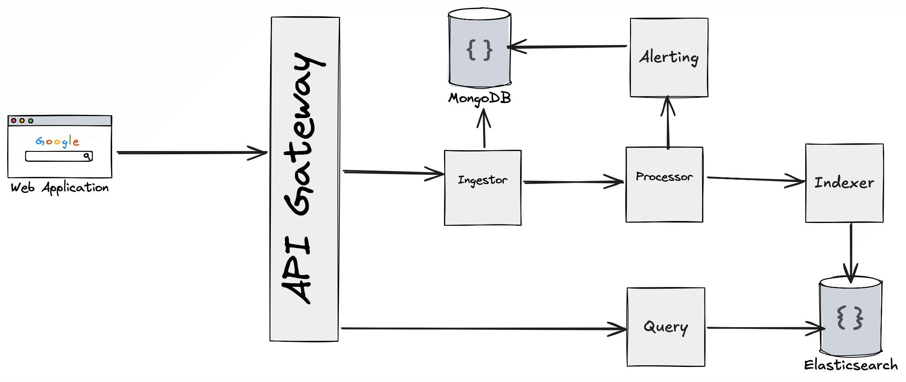

Architecture

## Introduction

This document describes the architecture of the system. It is intended to provide a high-level overview of the system's components and their interactions.

## Components
The system consists of the following components:
1. Ingestor - The Ingestor is responsible for receiving data from the data source and forwarding it to the Processor.
2. Processor - The Processor is responsible for processing the data received from the Ingestor and forwarding it to the Indexer and Alerting Service.
3. Query service - The Query service is responsible for handling search queries from users and forwarding them to the Search Database.
4. Alerting service - The Alerting service is responsible for sending alerts to users based on the data received from the Processor.
5. Indexer - The Indexer is responsible for indexing the data received from the Processor and forwarding it to the Search Database.
6. Search database (Elasticsearch) - The Search Database is responsible for storing the indexed data and handling search queries from the Query service.
7. Management database (MongoDB) - The Management Database is responsible for storing the configuration data and handling requests from the Management API. 
8. API Gateway (Traefik) - The API Gateway is responsible for routing requests to the appropriate service based on the request path. **(Currently not implemented)**
9. Web UI - The Web UI is responsible for providing a user interface for interacting with the system. **(Currently not implemented)**
